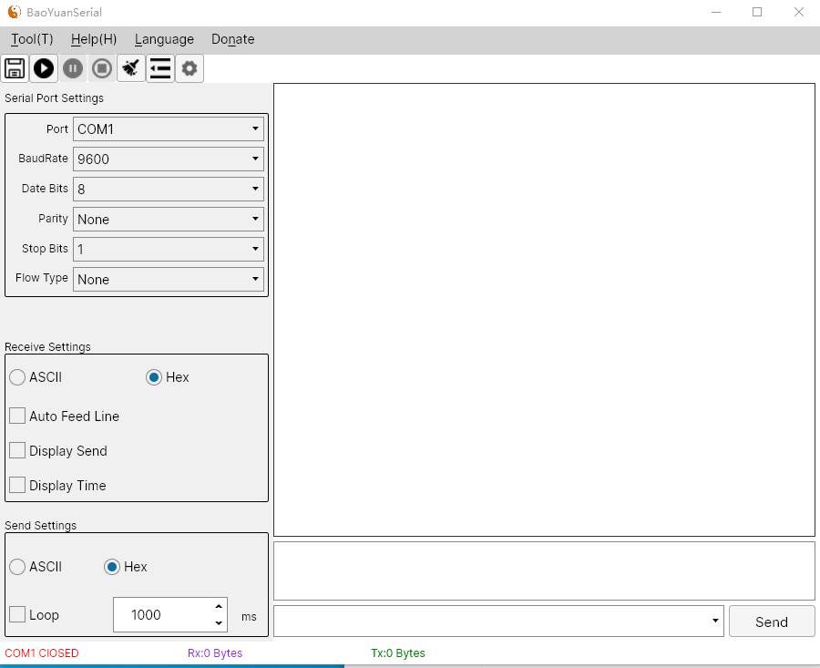

A GUI Serial Debug Tool for Linux/Microsoft Windows
====
Welcome to use the BaoYuanSerial that is a GUI serial debug tool for Linux(Ubuntu etc) . BaoYuanSerial is a open source project based on C#/Avalonia. There are the general functions as COMMON serial port debug tool. More new features will be developed. If you have any question and bugs found, please don't hesitate to push a new ISSUE on GitHub for us, we will deal with it at our convenient time. Thanks for your using.
  
  
My Avalonia QQ Group: 724430960
  
Welcome to join QQ group discussion
  
Eenvironment
----
Microsoft Window: WIN10_20H2  
Linux: Ubuntu20.04  
DotNet: dotnet5.0  
Avalonia: 0.10.6  

Using
----
AvaloniaUI  https://github.com/AvaloniaUI  

Install .Net In Linux  
https://docs.microsoft.com/zh-cn/dotnet/core/install/linux  

Create an Ubuntu program Desktop Icon article  
https://blog.csdn.net/lvyiwuhen/article/details/117579011

Interface
----
Microsoft Windows  
    
    
    
    
    
    
    
    
    
Ubuntu  
  
